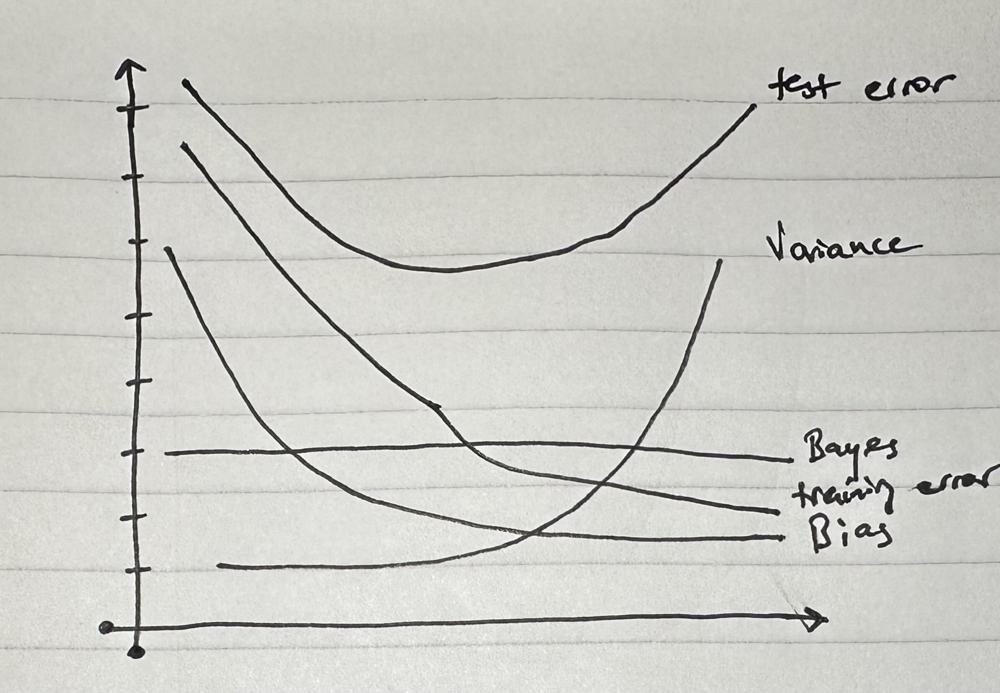

# Conceptual
## Question 1
### Part a
Flexible. With a large sample size and a low prediction count, you have a lot of information to train a flexible method. The few number of predictors leads to a lower risk of overfitting the data. 

### Part b
Since you don't have many observations, choosing a inflexible method would provide you with better results as more information is stored in the model itself. 
### Part c
If this relationship between predictors and response is highly non-linear, a flexible method might be able to fit these abnormal relations better with enough data. 
### Part d
Non-flexible. High variance in error terms means that a flexible method may attempt to overfit to these errors. Sticking with a non-flexible method will have a greater chance of underaccounting for these errors. That being said, if the underlying real-world relation is more complicated, a non-flexible model would fail to capture these relationships.  

## Question 2
### Part a
Regression; Inference; n = 500, p = 4
### Part b
Classification; Prediction; n = 20, p = 14
### Part c
Regression; Prediction; n = 52, p = 4

## Question 3
### Part a

### Part b
typical (squared) bias - bias is the error introduced by approximating a real world problem with a simple model. less flexible models introduce more error as they struggle to approximate highly complex problems. for this reason, the graph starts high. as the models become more flexible, the error they introduce due to oversimplication decreases.
variance - for less flexible models, the variance is extremely low as changes to the training data don't have a very strong effect on the underlying model. however, as flexibility increases, the effect that changes in training data have on a single data point increase due to the model having less information within itself.
training error - as model flexibility increases, the output of the model will more closely match the training data leading to it decreasing over time
test error - although training data decreases as model flexibility increase, after a certain point (where variance starts rising), overfitting will happen and the test error will begin to increase with model flexibility
Bayes (irreducible) error - the bayes irreducible error is always the same. irreducible error is constant and is not affected by model flexibility

## Question 4
### Part a
1. 